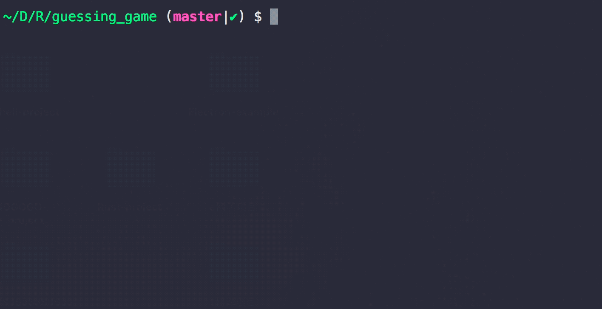

## 我的第一个 rust 尝试 demo

也就是 猜1-100以内的小游戏

https://kaisery.gitbooks.io/rust-book-chinese/content/content/Guessing%20Game%20%E7%8C%9C%E7%8C%9C%E7%9C%8B.html

这份小demo, 很棒噢 👌

---

> game demo, I play so bad😢

---

## Rust

本身的学习路途, 前期是较为崎岖的, 还是一步一步, 慢慢来

### Start

使用`Rust 本身的集成`-`rustup`是个很好的开始

https://rustup.rs/

## 为什么开始尝试 Rust 

因为我被 震惊了 , 在尝试

https://github.com/nathan/pax

The fastest JavaScript bundler in the galaxy.

银河系内最快的`js`打包, 是不是吹得一手🐂B

虽然, 功能很精简, 但是, 速度是无与伦比的, 怪不得 `Firefox` css处理, 重构是用 `Rust`

### 对比 Rust 和 Go

我引用一下, 看到的 [英文博客](https://matthias-endler.de/2017/go-vs-rust/)「我翻译一下」

#### 我喜欢Go的一些东西

- 快速编译时间
- 务实的解决问题的方法
- 典型的DevOps任务的良好生态系统
- 电池包括标准库
- IDE支持
- 简单的错误处理
- 吉祥物😉

#### 我更喜欢Rust的一些东西

- 安全性：没有空指针，没有数据竞争，...
- 细粒度的系统控制
- 令人难以置信的运行速度（与C / C ++相当）
- 零成本抽象
- 真棒，开放的社区
- 货物简单的包裹管理
- 以特征形式支持泛型
- C互操作和FFI

### 结论

99％的时间，Go是“足够好”，1％是不够的，你会知道的。然后看看Rust，因为这两种语言相得益彰。

毕竟，[Rust和Go并不是真正的竞争对手。](https://dave.cheney.net/2015/07/02/why-go-and-rust-are-not-competitors)